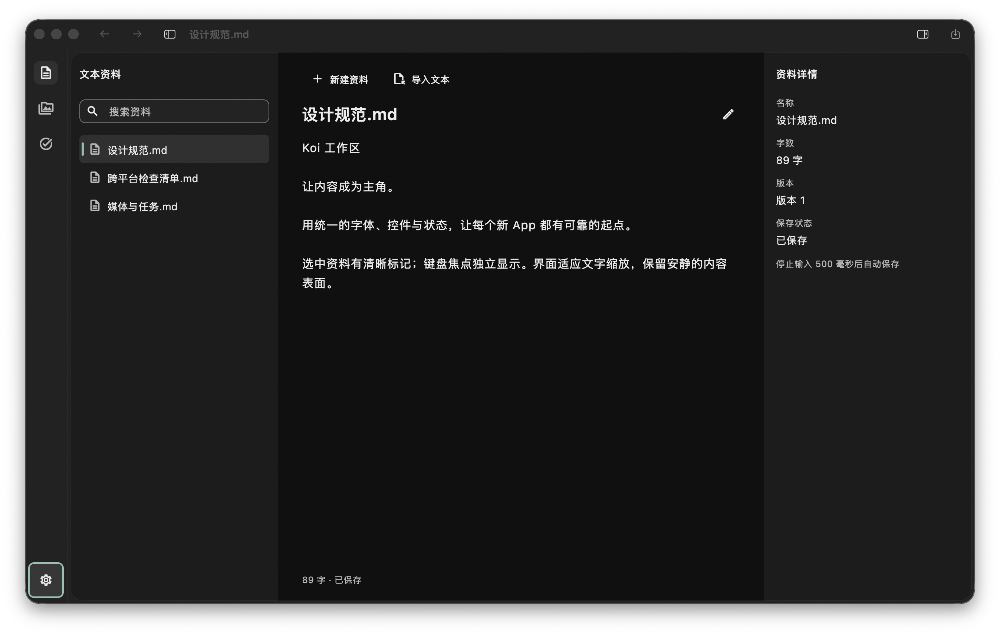
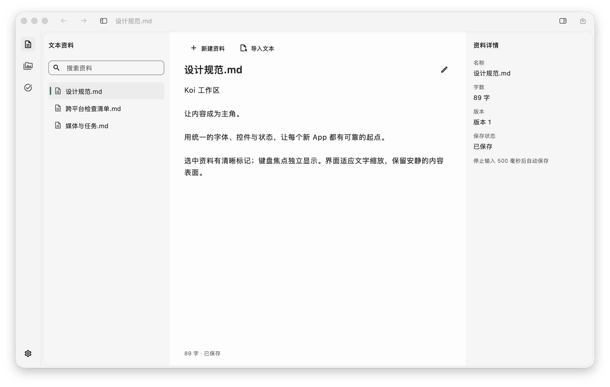

# ChatGPT / Codex 实现证据到 Koi Flutter UI Kit

日期：2026-10-01。范围：用户指定的本机安装包研究、共享 UI 主题与组件目录、工作台分层修正。保留原工作树、业务架构、路由、存储和媒体会话。

## 结论

可以直接读取 `/Users/max/Downloads/ChatGPT-Contents/Resources/app.asar` 中打包的 CSS 和共享组件代码，提取足够多的设计参数与交互依据。此次保存了 **176 条 CSS 声明、11 项交互证据**，包括选择器、字符偏移及资源 SHA；没有完整解包。它并不是官方完整设计文档，无法仅靠静态代码唯一恢复所有窗口的透明材质和最终像素。

本轮已把这套参考系统化映射到 Flutter：**标准组件 → ThemeData → 轻量组合 → 确有缺口的自定义组件**。没有创建平行的 Koi Button、Checkbox、Dialog 引擎，也没有引入另一套状态管理或 UI 依赖。

- [安装包提取报告](evidence/2026-10-01-ui-kit/bundle-findings.md)
- [来源和 token 记录](evidence/2026-10-01-ui-kit/bundle-tokens.json)
- [只读提取脚本](evidence/2026-10-01-ui-kit/extract_bundle_evidence.py)
- [修改前组件审计](evidence/2026-10-01-ui-kit/component-audit.md)
- [Flutter 设计规范](../../DESIGN.md)

## 共享实现

`AppTheme` 保持公开入口，内部 `koi_material_theme.dart` 集中装配标准 Material 主题。所有消费 `koi_ui` 的 App 共用以下规则：

| 范畴 | 已落地内容 |
| --- | --- |
| 表面 | 标题栏/图标栏、资料侧栏/详情、正文、浮层各自有明确角色；侧栏与正文不再同色 |
| 按钮 | 主要操作保留品牌，次要操作中性；32/48最小尺寸、圆角、hover/pressed/focus/disabled；Filled 焦点增加对比内带 |
| 输入与搜索 | 正常/禁用/错误/聚焦错误；Dropdown 显式复用输入主题；SearchBar/SearchView 主题 |
| 选择 | Checkbox、Radio、Switch、Chip、SegmentedButton 的共享状态，禁用优先于选中 |
| 菜单 | MenuAnchor、MenuBar、PopupMenu 的浮层规则；KoiMenu 增加 checked 与 shortcut 提示，继续委托标准组件交互 |
| 导航与数据 | TabBar、Rail/Bar、Drawer、ListTile、DataTable、Scrollbar；表格行高可增长 |
| 反馈与模态 | Tooltip、SnackBar、MaterialBanner、Dialog、BottomSheet、Slider、ProgressIndicator 与文本选区 |

DataTable 全局行高上限保持有限，修复从普通 Material 主题切换到 Koi 时 infinity 插值断言。菜单的 shortcut 只显示提示，实际命令仍由宿主 Shortcuts/Actions 注册一次。工作台主题菜单显示当前勾选项。上轮误加的 macOS 前后退组合胶囊已撤掉，两个原生按钮及各自历史状态保留。

## 可操作的 UI Lab

[UI Lab 源码](../../examples/ui_lab/lib/main.dart) 保留原工作区演示，新增[标准组件目录](../../examples/ui_lab/lib/standard_component_catalog.dart)：操作、输入、选择、导航、数据、反馈六类。控件不写局部视觉样式，直接证明共享主题生效。

目录包含真实本地交互：表单错误/修正、选择/筛选、排序、多选、菜单、取消/确认、撤销、横幅关闭、底部选择器、数值与确定进度预览。示例提交只改变 Lab 状态，不代表接通企业后端。

增加最小 Web runner，可从 `examples/ui_lab` 直接运行 `../../tool/flutterw run -d chrome`，或 build web 后本地服务预览。无需再生成临时 App 才能查看。UI Lab 继续是维护源码，不进入生成项目活动依赖。

## 实际界面

最终 macOS Release 宿主：逻辑窗口1280×788、DPR2、100%字号、compact；当前资料“设计规范.md”，89字、版本1、已保存。系统标题栏未激活，系统按钮因此灰色；截图包含窗口阴影。宿主20个共享UI源码文件与当前源仓库逐一 SHA 对照一致。

实际操作确认：原生侧栏/详情按钮可开关，明暗菜单勾选正确并生效；重开仍保留中文资料和主题。没有改动真实用户业务数据，资料来自独立验证宿主。

Chrome 运行 UI Lab：启用Flutter语义，切换标准目录/主题/密度，空表单显示“请输入成员姓名”，输入“产品设计组”后提交显示已保存；对话框默认聚焦取消，Escape关闭后焦点返回触发按钮。浏览器截图已现场查看，未保存为独立文件。macOS菜单条目未被AX桥完整暴露，主题选项使用截图定位点击；不据此宣称VoiceOver验收。

## 验证记录

| 项目 | 结果与证据 |
| --- | --- |
| 标准控件专项 | 16项通过：[日志](evidence/2026-10-01-ui-kit/material-controls-tests.log) |
| UI Lab | 14项通过；320/600/1024/1440、200%字号、实际320窗口浮层交互：[日志](evidence/2026-10-01-ui-kit/ui-lab-tests.log) |
| 全仓 validate | 通过；手写Dart覆盖率 **89.50%（4448/4970）**，未采集源计为未覆盖：[最终日志](evidence/2026-10-01-ui-kit/validate-final.log) |
| macOS Release | 最终构建通过，codesign严格校验通过：[构建](evidence/2026-10-01-ui-kit/build-macos-final.log) |
| 模板 Web Release | minimal与workbench构建通过：[minimal](evidence/2026-10-01-ui-kit/build-minimal-web.log)、[workbench](evidence/2026-10-01-ui-kit/build-workbench-web.log) |
| UI Lab Web Release | 仓库直接runner构建通过：[最终日志](evidence/2026-10-01-ui-kit/build-ui-lab-direct.log)；本机[交互预览](http://127.0.0.1:8791/)已切换到该产物 |
| 生成继承 | 两种模板实际create成功；21项主题/规范文件逐字节对照：[记录](evidence/2026-10-01-ui-kit/template-inheritance.json) |
| 真实运行 | macOS明暗/面板/重开；Chrome目录表单/对话框/焦点；[运行记录](evidence/2026-10-01-ui-kit/runtime-evidence.json) |
| 其他平台 | Android/iOS/Windows/Linux本轮构建与运行、Safari、本轮完整读屏/真实触摸矩阵：NOT_RUN |

运行宿主与版本的区别：macOS、workbench Web沿用已实际生成的工作台验证工程并同步共享源码；minimal在本轮新生成，Web默认入口构建后将最终共享文件同步用于Lab宿主。随后另做本轮全新workbench生成并比对最终主题。不能把临时宿主同步称作生成器重新执行。Lab首次尝试在minimal包上下文直接编译外部源文件，因 `package:ui_lab` 无法解析失败；改为明确的临时身份替换后通过，最终补直接runner消除此绕行。

macOS与直接UI Lab Web包含最终主题；workbench Web构建早于最后的inverse色与菜单可选图标微调，其构建结果不替代最终源码全平台验收。UI Lab Web构建仍有SDK对未打包CupertinoIcons字体的提示；当前目录使用Material图标且已实际显示，不据此声称Cupertino控件已验收。预览仅绑定127.0.0.1，停止本地服务后需按UI Lab README重新启动。

首轮完整门禁在并行编辑测试时碰到临时print的lint，已删除并重跑。历史侧栏验证曾因磁盘不足中断，本轮构建成功另有新日志；未用旧失败记录代替当前结果。

## 可复用边界

这轮交付是可运行、受测的企业应用基础 UI Kit，不是全品类企业业务组件库或像素级完整复刻。日期/时间选择器配方、树形浏览器、虚拟化大型表格、命令面板、专用高对比主题尚未纳入受测目录。新产品继续使用统一主题，并对自身业务流程、目标平台和输入方式补验收。

本轮基线、逐文件diff、源码与截图哈希均保存在 `evidence/2026-10-01-ui-kit/`；此前侧栏分色修正的基线在 `evidence/2026-10-01-sidebar-surface/`。没有提交、推送或发布。
