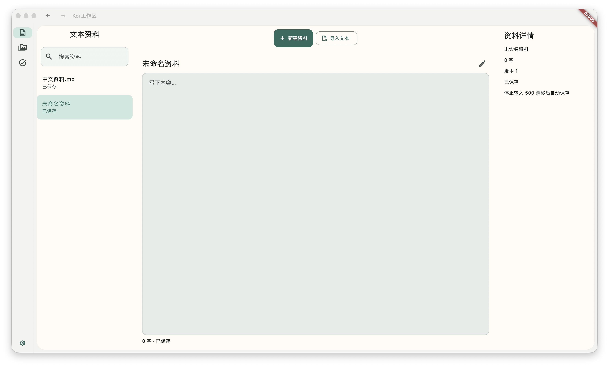
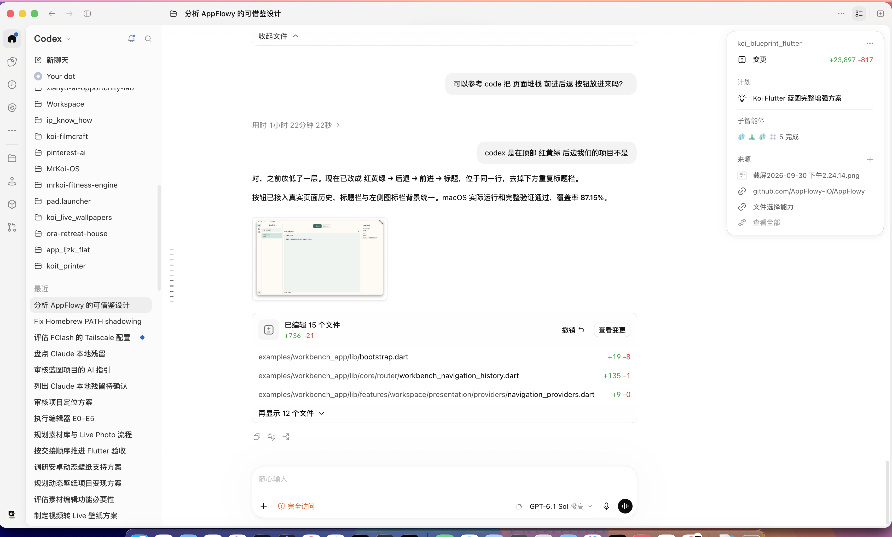
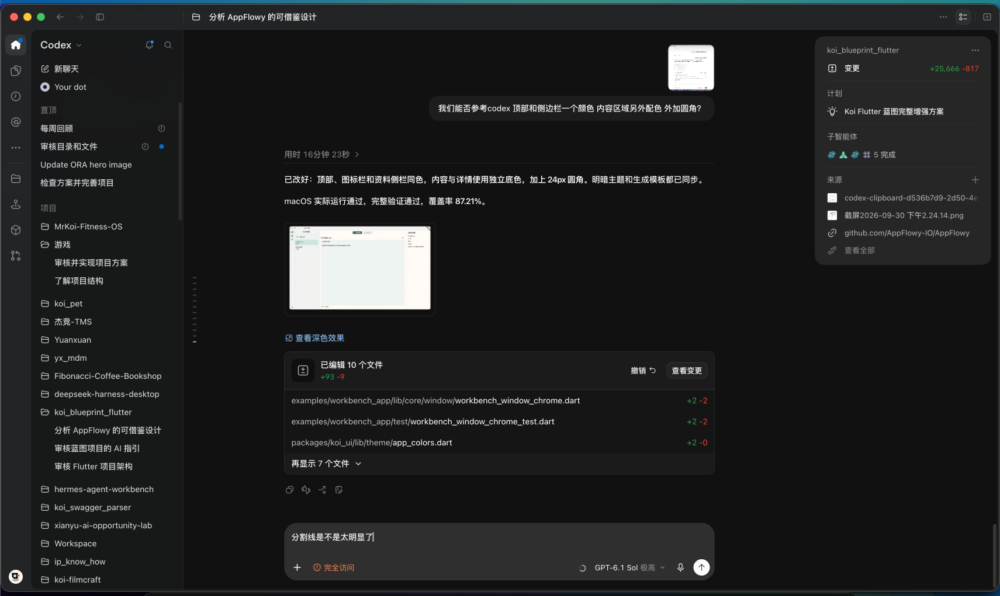
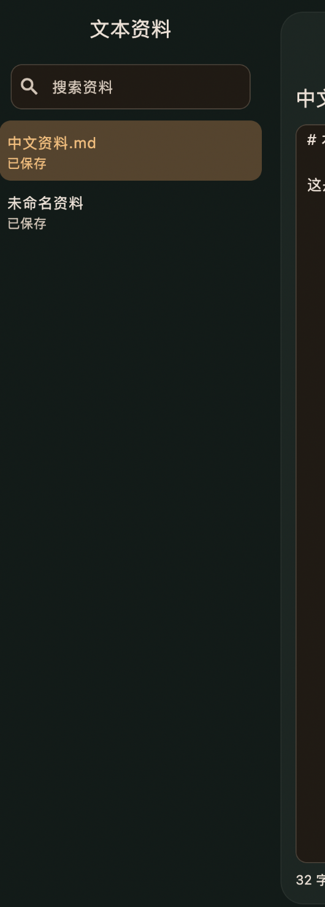
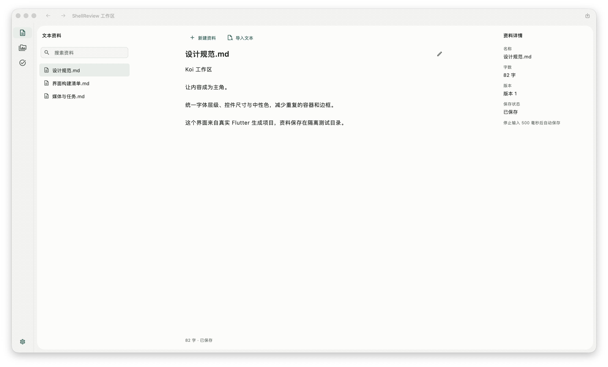
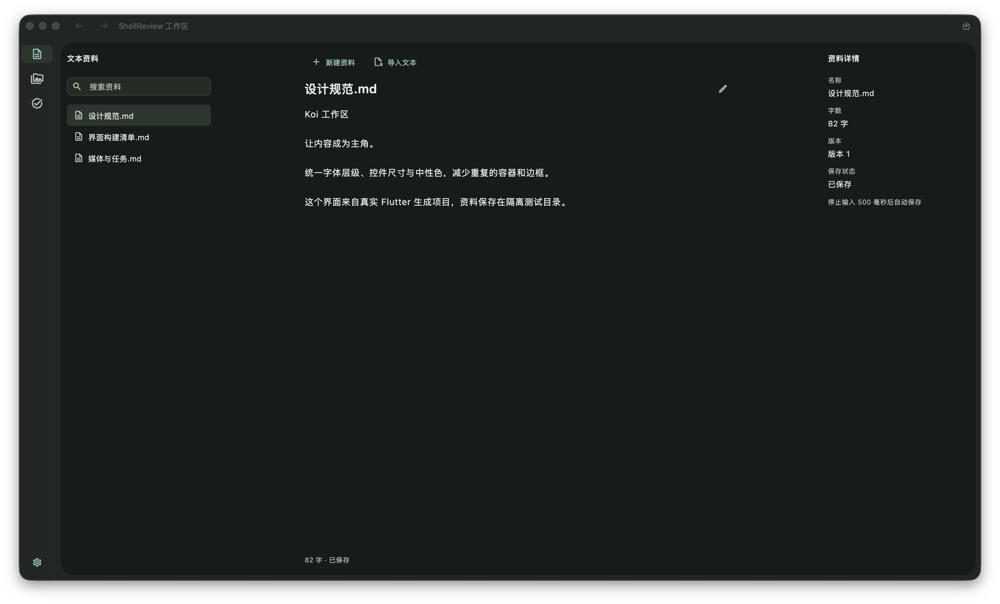
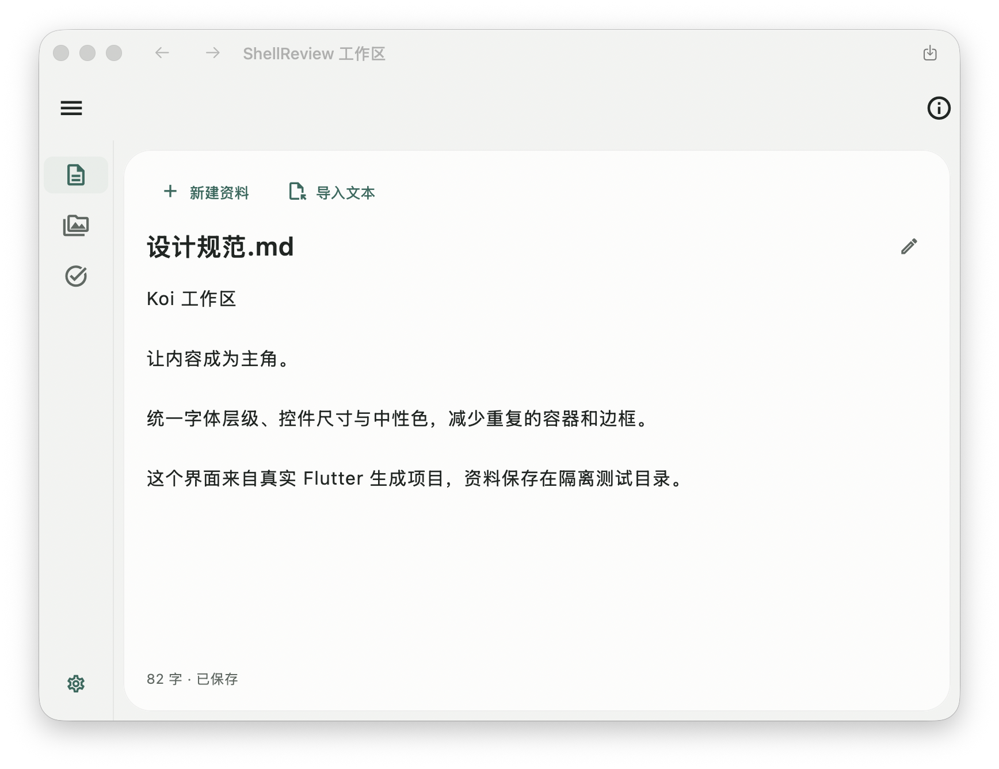

# Codex / AppFlowy / Koi：Flutter 桌面设计对照

研究与截图检查：2026-09-30。产物：[Flutter 目标规范](../../DESIGN.md)。用户随后授权实施，本次已完成对照、规范、共享主题/组件和工作台页面精修。六端设计验收另记，不能据本轮代码或本机构建宣称完成。

## 判断

**精修前的 Koi 已有桌面工作区骨架，但字体层级、控件密度和页面组合仍沿用通用 Material 表单，所以只修改底色、圆角和分割线不能解决“不精致”。** 这是改动前截图和源码支持的设计判断；下文分别保存改动前对照和改动后验收。

最明显的四个问题是：面板/文档/详情标题同等强调；已保存列表常驻两行；搜索和按钮的体量压过资料；正文被放进一块铺满主体的有色表单框。暗色界面又叠加了绿色容器与琥珀色控件，进一步增加视觉负担。

## 证据范围与限制

| 来源 | 实际取得的证据 | 没有取得的证据 |
| --- | --- | --- |
| 本机 Codex 与用户提供的 ChatGPT-Contents | 两份安装包版本均为 26.928.20755，三个主要 CSS 文件 SHA 完全一致；只读 ASAR 内静态 CSS；用户明确提供的明/暗截图 | 计算机控制禁止访问 `com.openai.codex`，没有新截图、现场操作、运行时 computed styles 或官方完整设计规范 |
| AppFlowy | 本机干净 checkout，固定 commit `5cf3a365dec0d59f64bad1ee4bb1050471a39b93`；主题、排版、按钮、输入及工作区尺寸源码 | 本轮没有安装/运行 AppFlowy，没有 AppFlowy 新截图，不断言该 commit 是今天最新 main |
| Koi | 改动前 Debug 宿主截图；改动后真实生成项目的 macOS Release 明/暗文字页、任务空态；中文资料重开显示；原生历史后退操作 | 本轮没有走完媒体/任务流程、设置菜单、真实键盘输入和跨平台视觉矩阵 |
| Flutter | 官方自适应、输入、ThemeExtension 和命中尺寸资料 | 没有把文档示例当作 Koi 的实际验收结果 |

证据 [sources.json](evidence/2026-09-30-desktop-design/sources.json) 记录安装包 CSS 的路径/SHA、选定声明与所在规则、AppFlowy SHA、图片来源/SHA，以及当前源码和截图宿主的比对。AppTheme、WorkbenchFrame 字节一致；资料侧栏和文本页在生成身份替换后字节一致。

本轮待修改文件的原始副本与 SHA 保存在 [基线清单](evidence/2026-09-30-desktop-design/baseline.json)。已有工作树修改继续保留。

## 截图检查步骤

### 1. Koi 改动前文字页：需要精修

实际状态：逻辑窗口 1710×1007，明色，选中“未命名资料”，0 字、版本 1、已保存；截图包含系统阴影，保存图片尺寸不能当作逻辑窗口尺寸。标题栏未激活，灰色系统按钮是窗口状态；Debug 标记不是产品设计。

观察：三个标题都较大；两颗按钮居中、体量明显；资料列表每项两行，选中项大片绿色；正文呈现一个巨大输入框；详情里说明文字与属性值接近同等强调。外壳/内容分色、圆角和隐藏式面板边界已经可见，不是当前主要短板。

本轮两次尝试打开设置菜单，没有观察到菜单展开，也没有应用主题/密度选项。该交互没有通过验收；不能从这张截图宣称浮层、键盘或焦点行为正确。资料内容没有修改。

### 2. Codex 用户明色截图：层级参考清楚，交互未验证

标题栏/固定图标栏底色接近，侧栏文字紧凑，选择底色低强调；聊天正文有阅读宽度，工具按钮较小。右侧面板是浮在内容上的独立卡片，它的层级不能直接套用到 Koi 所有详情面板。截图中项目树是全局导航；Koi 的资料列表属于当前工作区内容，应保留已确定的内容区归属。

### 3. Codex 暗色与 Koi 用户暗色局部：颜色差异明显，范围有限

Codex 的截图显示低饱和背景、小幅表面差异和弱边界；正文、辅助文字、分组标题的强调等级不同。截图不能说明这些颜色在所有主题/页面固定不变。

Koi 局部截图显示绿色大面积背景、琥珀色输入框/选中项以及较大的双行列表。它是用户此前提供的局部状态，不能作为当前完整暗色窗口的新验收证据。

### 4. Koi 首轮明色宽窗口：共享规范已被真实生成项目消费

实际状态：1710×1007 逻辑窗口、DPR 2、100% 字号、compact、明色；选中“设计规范.md”，82 字、版本 1、已保存。系统标题栏处于未激活状态。数据来自独立截图测试 App 的应用管理目录；main 仅加入中文 fixture 和明确的主题/密度偏好，公共主题、组件与当前源码 SHA 一致。这张宽窗口图片拍摄于最后统一侧栏 12 像素外边距、补充文件名 Tooltip 之前；最终代码的暗色宽窗口和明色中等窗口见步骤 5/6。

观察：面板标题与文档标题形成层级；资料常态单行且使用弱选中；搜索、小型工具栏、正文和详情属性各有职责；资料列表与详情同处圆角内容表面。正文去掉大表单框，保留阅读宽度。重新启动后中文资料可见；原生后退已实际从任务经媒体返回文字页。这个步骤没有验收完整键盘输入、设置菜单或媒体播放。

### 5. Koi 改动后暗色：同一资料的实际窗口

与步骤 4 使用同一资料、字号、密度和逻辑窗口尺寸；已包含最终侧栏对齐与 Tooltip 调整。关闭测试 App 后只修改它自己的持久化主题偏好，再重新启动；不是通过设置菜单切换，因此不构成设置交互验收。暗色输入和选中恢复中性表面、正文不再出现琥珀色大输入框，苔绿只用于操作和小图标。截图可以支持这页的视觉判断，不能证明六端对比度、读屏或全部状态都已通过。

### 6. Koi 最终明色中等窗口：保留正文与可达操作

实际状态：800×600 逻辑窗口、DPR 2、100% 字号、compact、同一份 82 字资料。资料/详情改为按需入口，主体保留新建、导入、编辑及保存状态；正文没有横向溢出。此时自动化接口连接窗口超时，改用只读窗口清单识别测试 App 的唯一窗口并保存、检查截图；未操作这些按需入口，也没有据图片宣称其交互通过。

步骤 4–6 的图片已保存、打开检查并与对应窗口/资料状态核对；细节与 [验收记录](evidence/2026-09-30-desktop-design/checks.md) 相互对应。

## 其他桌面设计依据

微软 [Fluent 字体规范](https://fluent2.microsoft.design/typography) 明确列出 Web/Windows body 14/20、caption 12，并区分 macOS 的原生字体规格；因此本方案采用角色组织方式，不强行统一六端字体文件。其 [布局规范](https://fluent2.microsoft.design/layout) 以四像素为基础，同时保留 6/10 等用于光学对齐的档位，支持用邻近与留白分组。Koi 补充 6/12/20 的间距用于桌面控件。

[VS Code UX 指南](https://code.visualstudio.com/api/ux-guidelines/overview) 是扩展界面的区域与交互指南；用于核对全局入口、侧栏和内容操作的归属，不是 Koi 的视觉模板。本轮没有检查 VS Code 实际窗口，也不据文档描述它的精确字体、颜色或控件尺寸。

## 数值和实现方式的对照

| 维度 | Codex 可核对事实 | AppFlowy 固定源码事实 | Koi 精修前源码事实 | Flutter 建议 |
| --- | --- | --- | --- | --- |
| 字体角色 | shared CSS 基础角色 11/12/14/16；Electron 规则覆盖部分为 12/13；其他局部表面有 12/14/16/18 | body 14/20、caption 12/18、heading4 16/22，字重另有档位 | AppTheme 没有显式 TextTheme；多个面板直接使用 titleLarge | 建立 UI 14、辅助 12、面板 14/600、正文 16 的明确角色 |
| UI/内容字体 | 系统 UI 字体栈；内容字体可独立配置；等宽字体另有角色 | fontFamily 参数贯穿主题字体角色 | 没有统一的 UI/正文字体配置；原生标题另写 15/semibold | 集中 UI TextTheme，正文与原生标题设明确适配契约 |
| 间距 | 多档 spacing/control 语义，具体生效值依规则与主题 | 4/6/8/12/16/20 | KoiSpace 为 4/8/16/24/32；itemPadding 8 或 16 横跨多种控件 | 补 6/12/20，并按控件分别定义尺寸 |
| 圆角 | shared CSS 提供多档 base radius，例如 .75rem 和 1.5rem | 4/6/8/12/16/20 | 8/12/24；按钮、输入、列表多为 12 | 列表 6、控件 8、浮层 12、外壳 24 |
| 工作区尺寸 | sidebar token 默认偏好 275，范围受窗口约束；toolbar token 有 46px | topBar 44、tabBar 40、搜索/新建区 30；移动列表另有 48 | 固定栏 64、面板 280；内容外边距 8、圆角 24 | 保留 Koi 壳参数，先精修内容配方 |
| 表单控件 | 背景、边框、文字由独立语义角色映射 | AFTextField 使用 body、isDense:true、明确 padding/radius | filled + surfaceContainerLow + 通用 itemPadding | 搜索/表单使用小型变体，正文与表单分开 |
| 按钮 | control 大小/角色及文字样式分档 | s/m/l 使用 body enhanced，padding 垂直 4/6/10 | FilledButton 默认垂直 itemPadding，comfortable 为 16 | compact 基线 32，comfortable 实际触摸布局 48 |
| 边界 | hairline token .5px；局部 border-light 为 #0000000d / #ffffff0d；透明 sidebar-divider 只在特定 docking-peek 规则 | border/fill/surface 等角色区分 | 外壳 6% 结构线已与输入框边框分开 | 继续保留弱结构边界，清楚呈现控件和焦点 |

注意：CSS 的默认声明可能被上下文覆盖，rem 依根字号决定大小；上表没有把任何一个 token 当成所有 Codex 页面实际样式。AppFlowy 同时存在新 AF 组件与旧 Flowy 组件，上表只描述所读文件，不宣称所有界面均已使用新设计系统。

AppFlowy 小号按钮的 14/20 文字加上下 4 padding 可以解释其紧凑倾向；不同 wrapper/图标会影响最后尺寸，因此不能把这个计算当作运行截图实测高。Koi 也没有在本轮进行像素标定，按钮/行高以源码行为和截图观察解释，目标数值另列在 DESIGN.md。

## 精修前的具体差距：为什么还需要页面配方

### A. 字体没有形成产品层级

资料标题、详情标题和文档标题都用 `titleLarge`。当前 Material 3 基线角色为 22，作为每个面板的标题会让信息同等响亮。应先给 `koi_ui` 建立主题字体映射，再把面板标题改用语义角色。调整主题后仍需修改错误的角色选择，不能仅全局缩小字体。

### B. 一个 padding 代替了整个控件尺寸体系

compact/comfortable 当前主要是 VisualDensity 与 8/16 的 padding。它没有表达搜索、列表、菜单和工具栏的不同用途。两行 ListTile 和较大的 FilledButton 放进桌面工作区，产生表单式体量。需要分别定义尺寸，而不是把 VisualDensity 设为 compact 就认为完成。

### C. 暗色主题的 seed 改变了产品语义

AppTheme 明色使用 moss seed，暗色使用 amber seed；输入框继续取生成色系中的 surfaceContainerLow。再叠加手写的绿色背景，容易得到绿底、褐色表单和金色选中项的组合。建议统一强调色语义，中性表面显式定义，琥珀色只用于提示。

### D. 文档编辑器沿用了普通输入框外观

`TextField(expands:true)` 可以继续承担纯文本编辑，但装饰不应继承搜索/重命名的整套表单外观。当前铺满主体的有色边框框把内容压成一个大型控件。建议正文融入内容面板，并加阅读宽度约束；标题、正文与状态共用对齐线。Flutter 官方也建议避免大屏表单无限填满水平空间。[自适应建议](https://docs.flutter.dev/ui/adaptive-responsive/best-practices)

### E. 样例组合尚未表达成熟的桌面工作流

新建/导入是居中的大按钮，标题横跨整个文档区域，详情未区分属性名与值。即使每个基础组件都合理，组合仍可能显得松散。`koi_ui` 需要共享尺寸和必要变体；App presentation 需要实际页面配方。`HomeSideBar` 是 AppFlowy 业务组件，不能作为 Flutter 标准控件或直接替换 Koi 会话/路由。

## 建议的实施顺序

| 次序 | 修改 | 验证方法 |
| --- | --- | --- |
| 1 | TextTheme、角色选择、按钮/输入/菜单/列表尺寸表 | UI Lab 对照 + 文字页截图，长中文和 200% 字号 |
| 2 | 明暗中性色、弱选中、正文装饰与控件圆角 | 同一数据、同一窗口下比较明/暗，两种密度 |
| 3 | 资料侧栏单行常态、工具栏、阅读宽度、详情属性配方 | 切资料、搜索、保存/失败、resize，检查状态保持 |
| 4 | 图标光学对齐、hover/focus/disabled、菜单与触摸变体 | 真键盘/指针检查，目标平台单独运行 |

此次不需要更换 Material、引入 AppFlowy BLoC、改变数据层、另建 Web 前端或重做导航历史。优先修当前样例最容易暴露的问题，再以相同 token 覆盖其他样例和两种生成模板。

## 本轮落地

已修改 AppTheme 的文字角色、中性明暗表面及按钮/输入/菜单等主题；KoiThemeTokens 增加 hover/overlay 与独立尺寸，保留旧构造和 Material 回退。KoiSelectableListTile 使用低强调选中底色、密度尺寸与独立键盘焦点环。

新增共享 KoiSearchField、KoiToolbar、KoiReadingPane、KoiPropertyRow。工作台真实消费这些组件：常态资料列表单行、工具栏左对齐、正文最大 800 且去除大表单框、详情区分属性名/值。UI Lab 展示新角色与组件；Admin、starter、module showcase 自动消费更新的公共主题。macOS 桥接传递 titleSmall 的字号/字重，生成的原生标题使用该规格。

完整改动和本轮运行截图/日志见 [checks.md](evidence/2026-09-30-desktop-design/checks.md)。截图步骤 1–3 是改动前/参考对照；步骤 4 是首轮实际明色，步骤 5–6 对应最终代码。

## 交付和验证状态

- **完成**：独立对照、原始证据保存、Flutter DESIGN.md、当前差距和实施顺序。
- **完成**：设计入口连接至 README、AI Quickstart、koi_ui 说明；两种模板生成时带上 DESIGN.md，递归生成保留目标项目的设计规范。
- **完成第一轮**：本文提出的共享字体、颜色、控件规格、文本/资料/详情配方及 UI Lab 接入。
- **待进一步验收**：其他视图全部状态的视觉回归、跨平台字体/图标光学一致性及真实触摸表现。
- **通过**：本轮最终完整 validate，手写覆盖率 87.66%（3589/4094）；真实生成工作台的 macOS/Web Release 构建；默认 minimal 真实生成与 AI 资产检查。
- **实际运行**：macOS Release 明/暗文字页及中文资料重开显示、原生历史后退；任务空态另有截图。
- **NOT_RUN**：Codex/AppFlowy 实时交互、Android/iOS/Windows/Linux 的本轮构建/运行、完整键盘/读屏、Chrome/Safari 视觉矩阵、六端完整业务运行。
- **本地门禁**：实际执行结果记在 [checks.md](evidence/2026-09-30-desktop-design/checks.md)，与代码、构建及真实运行分开报告。

## 源码与参考

Koi 当前入口：[AppTheme](../../packages/koi_ui/lib/theme/app_theme.dart)、[token](../../packages/koi_ui/lib/theme/koi_theme_tokens.dart)、[ListTile](../../packages/koi_ui/lib/widgets/koi_selectable_list_tile.dart)、[工作区壳](../../packages/koi_ui/lib/widgets/koi_workbench_frame.dart)、[资料侧栏](../../examples/workbench_app/lib/features/workspace/presentation/widgets/workspace_panels.dart)、[文本页](../../examples/workbench_app/lib/features/workspace/presentation/screens/text_page.dart)、[原生配置](../../tool/platform_configuration.py)。

AppFlowy 固定 commit 的一手源码：

- [字体角色](https://github.com/AppFlowy-IO/AppFlowy/blob/5cf3a365dec0d59f64bad1ee4bb1050471a39b93/frontend/appflowy_flutter/packages/appflowy_ui/lib/src/theme/definition/text_style/base/default_text_style.dart)
- [间距、圆角和阴影](https://github.com/AppFlowy-IO/AppFlowy/blob/5cf3a365dec0d59f64bad1ee4bb1050471a39b93/frontend/appflowy_flutter/packages/appflowy_ui/lib/src/theme/data/shared.dart)
- [按钮尺寸](https://github.com/AppFlowy-IO/AppFlowy/blob/5cf3a365dec0d59f64bad1ee4bb1050471a39b93/frontend/appflowy_flutter/packages/appflowy_ui/lib/src/component/button/base_button/base.dart)
- [输入框](https://github.com/AppFlowy-IO/AppFlowy/blob/5cf3a365dec0d59f64bad1ee4bb1050471a39b93/frontend/appflowy_flutter/packages/appflowy_ui/lib/src/component/textfield/textfield.dart)
- [工作区尺寸](https://github.com/AppFlowy-IO/AppFlowy/blob/5cf3a365dec0d59f64bad1ee4bb1050471a39b93/frontend/appflowy_flutter/lib/workspace/presentation/home/home_sizes.dart)

Codex 的本机打包样式仅用于有限事实对照；它不是 OpenAI 公开发布的设计规范。没有复制完整 CSS，也没有重新分发其图标、字体或应用代码。

Flutter：通过 [ThemeExtension](https://api.flutter.dev/flutter/material/ThemeExtension-class.html) 扩展产品语义；保留 [输入、焦点与键盘](https://docs.flutter.dev/ui/adaptive-responsive/input) 支持。紧凑视觉与实际触摸尺寸分别设计，[MaterialTapTargetSize](https://api.flutter.dev/flutter/material/MaterialTapTargetSize.html) 提供 padded/shrinkWrap 策略，不能自动解决相邻小行的重叠命中问题。
