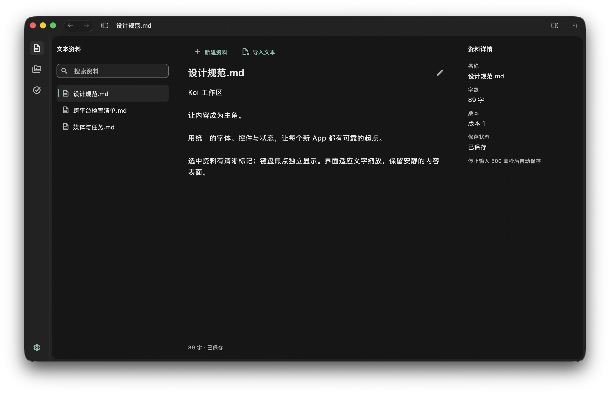
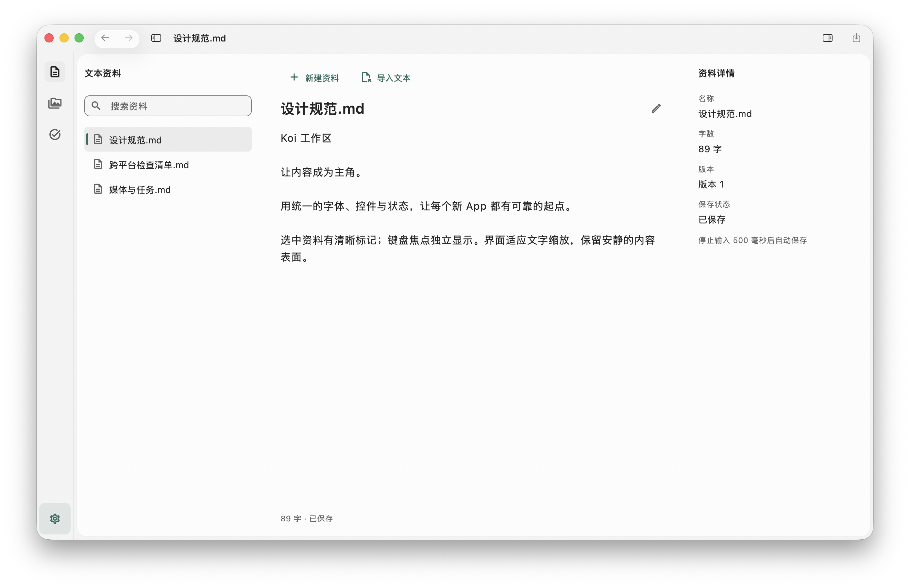

# 工作台中性外壳与工具栏精修 — 2026-10-01

## 修改完成

按照用户提供的 Codex/Koi 同屏截图收敛视觉；没有声称取得 Codex 内部 UI 源码。本轮继续保留已有工作树和路由、工作区、播放器、编辑器的拥有者。

- `koi_ui` 大面积表面改为中性灰；深色外壳 `#222222`、内容 `#161616`。品牌绿保留在操作、焦点和内容选中短标记，固定导航选中图标使用正文色。
- `KoiWorkbenchMetrics` 集中维护图标栏 56、可见选中底 32×32、内容外留白 4、外圆角 16。命中区仍至少 48；资料列表、主体与详情仍是同一内容表面，语义容器和真实裁剪保留。移动底栏仍为 Material 3 默认高度，safe-area 只计一次。
- macOS 前后退放在一个原生工具栏项内，按钮各 32×28、间隔 4；各自保留名称、回调和禁用状态。面板按钮保留 toggle 状态，显式采用中性图标色，消除原来的蓝色强调。
- 标题跟随当前资料/素材或任务页面，重命名与历史回放同步更新。原生标题继续读取主题字号/字重，长标题截断；Flutter 回退标题消费相同窗口上下文。
- 当前标题独立选择状态，任务进度更新不会重建 App 主题或无关文本编辑器。宿主继续拥有原生桥接，纯 UI 包不引入业务依赖。
- `DESIGN.md` 与共享包 README 同步，新生成的工作台继承窗口配置和 UI 规格。

受影响的 14 个实现、测试和规范文件已有逐文件基线、SHA-256 和补丁，见 [changes.json](evidence/2026-10-01-neutral-chrome/changes.json)。未执行提交、推送或部署。

## 本地门禁

完整 `python3 blueprint.py validate`：**PASS**，手写覆盖率 **88.66%（3955/4461）**。未新增目录级覆盖排除。

受影响 Flutter 测试 55 项通过，平台配置 Python 测试 4 项通过。覆盖主题对比、导航目标、320/600/1024/1440 与 200% 字号、重命名标题、资料/媒体/任务标题、历史回放和既有会话保持。完整门禁的 Chrome 存储桥接测试通过；这不能代替生成 UI 的浏览器实跑。

## 目标平台证据

从当前源码创建新的 `chrome_review` workbench，平台 macOS/Web。生成项目采用独立 fixture 身份。fixture 仅增加中文资料、两项待办、初始 compact/dark 偏好及初始窗口大小；这些样例内容和运行窗口尺寸不进入蓝图模板。

| 验证 | 本轮结果 |
| --- | --- |
| 新生成工作台 macOS release 构建 | PASS |
| `codesign --verify --deep --strict` | PASS |
| macOS 实际运行：标题、前后退、面板开关、明暗主题 | PASS |
| 新生成工作台 Web release 构建 | PASS |
| Chrome 存储桥接门禁 | PASS |
| 生成 UI 的 Chrome/Safari 手动实跑 | NOT_RUN |
| Windows/Linux/Android/iOS 构建与实跑 | NOT_RUN |
| VoiceOver 完整验收 | NOT_RUN |

实际窗口为 1280×788 逻辑像素；保存 PNG 含系统阴影，不把截图像素当作逻辑宽度。资料列表与主题菜单条目没有完整出现在此次本机自动化 AX 快照中，相关选择依据实际截图坐标操作；其余原生面板状态与窗口标题已观察到。探索性键盘操作误打开文件选择器，已取消且未选择文件，fixture 中留有一条已取消任务。没有据此宣称完整读屏验收。

当前 macOS 会为原生历史组绘制系统背板；标题仍按原生工具栏布局排列，尚未与可调整资料侧栏边缘做像素锁定。这些仍与参考截图有差异。

完整记录：[results.json](evidence/2026-10-01-neutral-chrome/results.json)、[validate 日志](evidence/2026-10-01-neutral-chrome/validate-final.log)、[macOS 构建](evidence/2026-10-01-neutral-chrome/build-macos.log)、[Web 构建](evidence/2026-10-01-neutral-chrome/build-web.log)、[fixture 路径](evidence/2026-10-01-neutral-chrome/runtime-project.json)。

## 实际界面

